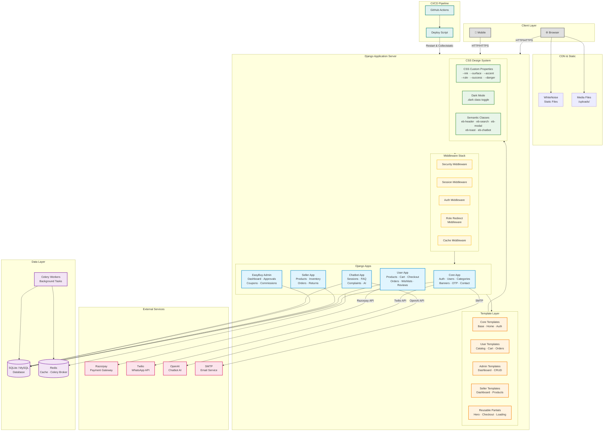
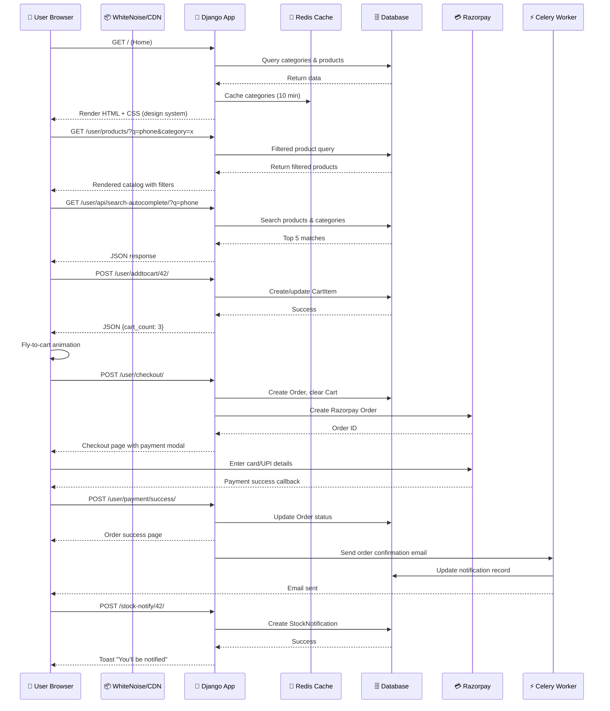
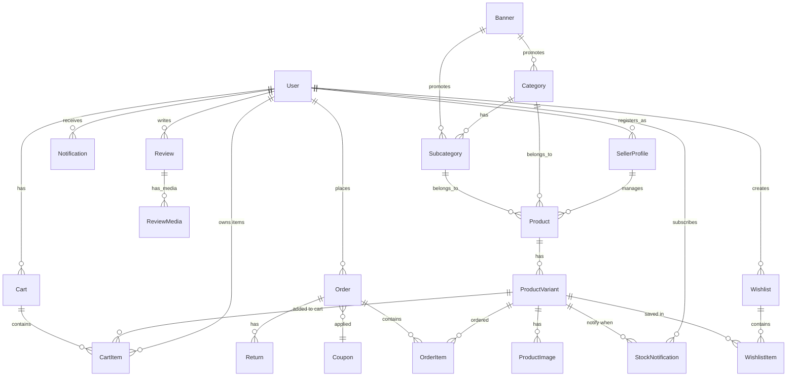

# EasyBuy

EasyBuy is a Django-based e-commerce platform with customer shopping flows, seller management, admin moderation, coupons, Razorpay payments, notifications, and an optional AI shopping assistant.

The project is organized as a multi-app Django system:

- `core`: authentication, custom user model, categories, banners, notifications, shared utilities, middleware, and public pages.
- `user`: storefront, filters, product detail pages, cart, checkout, Razorpay/COD order flows, wishlists, reviews, returns, saved addresses, saved cards, and customer notifications.
- `seller`: seller onboarding, seller dashboard, product/variant management, inventory, orders, reviews, returns, and seller promotions.
- `easybuy_admin`: admin dashboard, seller verification, product approval, categories, banners, users, coupons, discounts, offers, and commissions.
- `chatbot`: chat sessions, FAQ handling, complaint tickets, escalation logs, quick replies, and optional OpenAI-backed responses.

## Features

- Customer registration, login, OTP verification, password reset, and role-based redirects.
- Product catalog with categories, subcategories, filters, search, autocomplete, new arrivals, best sellers, and product detail pages.
- Cart, buy-now, checkout summaries, promo code handling, COD, Razorpay order creation, payment verification, failed payment logging, and Razorpay webhook reconciliation.
- Order history, order item cancellation, returns, shipments, and order status APIs.
- Wishlists with named collections and move-to-cart support.
- Product reviews with images/videos and helpful votes.
- Seller registration, approval workflow, inventory controls, product variants, order management, review replies, and return processing.
- Admin tools for sellers, users, product approvals, categories, banners, coupons, offers, discounts, and platform commission.
- In-app/email notifications, stock notifications, cart reminders, and optional WhatsApp notifications through Twilio.
- Chatbot widget with FAQ/product/order/complaint handling and optional OpenAI integration.
- Tailwind-powered storefront, admin, onboarding, and component CSS bundles.

## Tech Stack

- Python, Django 6
- SQLite for local development/tests; MySQL or `DATABASE_URL` for deployment
- Tailwind CSS
- Celery for background tasks
- Redis for cache/Celery broker when configured
- Razorpay for online payments
- Twilio for optional WhatsApp notifications
- OpenAI API for optional chatbot AI responses
- WhiteNoise and Gunicorn for production serving

## Project Structure

```text
.
├── chatbot/                      # Chat sessions, FAQ, complaint, AI assistant logic
│   ├── models.py                 # ChatSession, ChatMessage, FAQ, ComplaintTicket
│   ├── services.py               # Chatbot response engine (OpenAI + fallback)
│   ├── views.py                  # Start/message API endpoints
│   ├── urls.py                   # /chatbot/start/, /chatbot/message/
│   └── migrations/
│
├── core/                         # User model, auth, catalog basics, shared utilities
│   ├── models.py                 # Custom User, Category, Subcategory, Banner, OTP
│   ├── views.py                  # Home, login, register, OTP, password reset, contact
│   ├── forms.py                  # Auth forms (login, register, password reset)
│   ├── context_processors.py     # Cart count, wishlist count, categories (cached)
│   ├── cache_utils.py            # Cached helpers with Redis fallback
│   ├── middleware.py             # Role-based redirect, maintenance mode
│   ├── notifications.py          # Email/WhatsApp notification dispatchers
│   ├── whatsapp_utils.py         # Twilio WhatsApp integration
│   ├── signals.py                # User post-save signals
│   ├── tasks.py                  # Celery tasks: cart reminders, stock alerts
│   ├── services.py               # Business logic helpers
│   ├── urls.py                   # /, /login/, /register/, /otp/, etc.
│   └── management/commands/      # Custom management commands
│
├── easybuy/                      # Django project configuration
│   ├── settings.py               # All settings, env-based config
│   ├── urls.py                   # Root URL routing
│   ├── asgi.py / wsgi.py         # ASGI/WSGI entry points
│   └── celery.py                 # Celery app configuration
│
├── easybuy_admin/                # Admin dashboard, approvals, coupons
│   ├── views.py                  # Dashboard, seller/user management, banners
│   ├── models.py                 # Coupon, Offer, Discount, Commission
│   ├── admin.py                  # Django admin customizations
│   └── urls.py                   # /easy_admin/dashboard/, /easy_admin/sellers/, etc.
│
├── seller/                       # Seller portal, products, inventory
│   ├── models.py                 # SellerProfile, Product, ProductVariant, ProductImage
│   ├── views.py                  # Dashboard, product CRUD, inventory, orders
│   ├── forms.py                  # Product/variant/seller registration forms
│   └── urls.py                   # /seller/dashboard/, /seller/products/, etc.
│
├── user/                         # Storefront — cart, checkout, orders, reviews
│   ├── models.py                 # Cart, CartItem, Order, OrderItem, Wishlist, Review
│   ├── views.py                  # Products, cart, checkout, payment, orders
│   ├── signals.py                # Order status change notifications
│   ├── urls.py                   # /user/products/, /user/cart/, /user/orders/, etc.
│   └── context_processors.py     # Additional user-specific context
│
├── templates/                    # Django HTML templates
│   ├── core/                     # Base layout, home, auth, contact, track order
│   │   ├── core_base.html        # Main storefront base template (design system)
│   │   ├── home.html             # Landing page with hero, promos, categories
│   │   ├── login.html            # Sign in page
│   │   ├── register.html         # Registration page
│   │   ├── auth_base.html        # Auth pages base template
│   │   └── ...                   # forgot_password, reset_password, verify_otp, etc.
│   │
│   ├── user/                     # Customer-facing pages
│   │   ├── all_products.html     # Catalog with filters, price slider, pagination
│   │   ├── cart.html             # Shopping cart with quantity controls
│   │   ├── checkout.html         # Checkout with address/payment selection
│   │   ├── product_details.html  # Product detail with variant selection
│   │   ├── orders.html           # Order history
│   │   ├── wishlist.html         # Wishlist collections
│   │   ├── best_sellers.html     # Best sellers grid
│   │   ├── new_arrivals.html     # New arrivals grid
│   │   └── ...                   # reviews, addresses, notifications, profile
│   │
│   ├── admin/                    # Admin panel pages
│   │   ├── admin_base.html       # Admin base template
│   │   ├── admin_dashboard.html  # Admin dashboard
│   │   ├── all_sellers.html      # Seller management
│   │   ├── all_users.html        # User management
│   │   ├── banner_list.html      # Banner CRUD
│   │   ├── promo_codes.html      # Coupon management
│   │   └── ...                   # categories, subcategories, approvals
│   │
│   ├── seller/                   # Seller portal pages
│   │   ├── seller_base.html      # Seller base template
│   │   ├── dashboard.html        # Seller dashboard
│   │   ├── add_product.html      # Product creation/editing
│   │   ├── inventory.html        # Inventory management
│   │   ├── orders.html           # Seller order management
│   │   └── ...                   # returns, reviews, promo codes
│   │
│   └── includes/                 # Reusable template partials
│       ├── hero_banners.html
│       ├── checkout_delivery_address.html
│       ├── checkout_payment_methods.html
│       ├── loading_components.html
│       └── logo_options.html
│
├── static/                       # Frontend assets
│   ├── css/                      # Built CSS bundles
│   │   ├── tailwind-storefront.css
│   │   ├── tailwind-admin.css
│   │   ├── tailwind-onboarding.css
│   │   ├── components-built.css
│   │   ├── easybuy-design-system.css
│   │   └── enhancements.css
│   ├── js/                       # JavaScript files
│   │   └── ui-enhancements.js
│   ├── src/                      # Tailwind source files
│   │   ├── storefront.css
│   │   ├── admin.css
│   │   └── onboarding.css
│   └── images/                   # Static images/logos
│
├── staticfiles/                  # Collected static files (for deployment)
├── media/                        # User-uploaded media (dev)
├── images/                       # Additional uploaded assets
│
├── scripts/                      # Utility scripts
│   ├── collect_metrics.ps1
│   ├── measure_client.py
│   └── measure_client_output.json
│
├── .github/workflows/            # CI/CD pipelines
│   └── deploy.yml
│
├── manage.py                     # Django management entry point
├── requirements.txt              # Python dependencies
├── package.json                  # Node.js dependencies (Tailwind)
├── tailwind.storefront.config.js # Tailwind config for storefront theme
├── tailwind.admin.config.js      # Tailwind config for admin theme
├── tailwind.onboarding.config.js # Tailwind config for onboarding theme
├── .env.example                  # Environment variable template
├── TEMPLATE_MODIFICATIONS.md     # Template diff documentation
└── INTERVIEW_PREP.md             # Interview preparation notes
```

## Architecture

### System Architecture Diagram



### Request Flow Diagram



### Data Model Relationships



## Important Routes

- `/`: storefront landing page.
- `/user/products/`: product listing and filtering page.
- `/user/cart/`: customer cart.
- `/user/checkout/`: checkout page.
- `/user/orders/`: customer orders.
- `/seller/dashboard/`: seller dashboard.
- `/seller/register/`: seller registration.
- `/easy_admin/dashboard/`: EasyBuy admin dashboard.
- `/admin/`: Django admin.
- `/chatbot/start/`, `/chatbot/message/`: chatbot API endpoints.
- `/health/`: health check endpoint.

## Local Setup

### 1. Create and activate a virtual environment

```powershell
python -m venv venv
.\venv\Scripts\Activate.ps1
```

### 2. Install Python dependencies

```powershell
pip install -r requirements.txt
```

### 3. Install frontend dependencies

```powershell
npm install
```

### 4. Configure environment variables

Copy `.env.example` to `.env` and adjust values for your machine:

```powershell
Copy-Item .env.example .env
```

For local development, the minimum useful values are:

```env
DEBUG=True
SECRET_KEY=replace-with-a-local-secret
ALLOWED_HOSTS=127.0.0.1,localhost
CSRF_TRUSTED_ORIGINS=http://127.0.0.1:8000,http://localhost:8000
```

If `DATABASE_URL` and MySQL variables are not configured while `DEBUG=True`, the project can use local SQLite.

### 5. Run migrations

```powershell
python manage.py migrate
```

### 6. Build CSS assets

```powershell
npm run build
```

For only the storefront bundle:

```powershell
npm run build:storefront
```

### 7. Start the development server

```powershell
python manage.py runserver
```

Open:

```text
http://127.0.0.1:8000/
```

## Environment Variables

The project reads configuration from `.env`.

### Core

| Variable               | Purpose                                         |
| ---------------------- | ----------------------------------------------- |
| `SECRET_KEY`           | Django secret key. Required when `DEBUG=False`. |
| `DEBUG`                | Enables local development behavior.             |
| `APP_BASE_URL`         | Public base URL used for absolute URLs.         |
| `ALLOWED_HOSTS`        | Comma-separated host allowlist.                 |
| `CSRF_TRUSTED_ORIGINS` | Comma-separated trusted CSRF origins.           |

### Database

| Variable       | Purpose                                                  |
| -------------- | -------------------------------------------------------- |
| `DATABASE_URL` | Full database URL, used when present.                    |
| `DB_ENGINE`    | Django DB backend, defaults to MySQL in production mode. |
| `DB_NAME`      | Database name.                                           |
| `DB_USER`      | Database user.                                           |
| `DB_PASSWORD`  | Database password.                                       |
| `DB_HOST`      | Database host.                                           |
| `DB_PORT`      | Database port.                                           |

### Email

| Variable              | Purpose                     |
| --------------------- | --------------------------- |
| `EMAIL_HOST_USER`     | SMTP sender account.        |
| `EMAIL_HOST_PASSWORD` | SMTP password/app password. |

### Payments

| Variable                  | Purpose                     |
| ------------------------- | --------------------------- |
| `RAZORPAY_KEY_ID`         | Razorpay key ID.            |
| `RAZORPAY_KEY_SECRET`     | Razorpay key secret.        |
| `RAZORPAY_WEBHOOK_SECRET` | Webhook signing secret.     |
| `RAZORPAY_TEST_MODE`      | Enables test mode behavior. |

### Redis and Celery

| Variable    | Purpose                                               |
| ----------- | ----------------------------------------------------- |
| `REDIS_URL` | Redis URL for cache and Celery broker/result backend. |

### Chatbot and AI

| Variable                 | Purpose                                  |
| ------------------------ | ---------------------------------------- |
| `CHATBOT_WIDGET_ENABLED` | Shows or hides the chatbot widget.       |
| `OPENAI_API_KEY`         | Enables OpenAI-backed chatbot responses. |
| `OPENAI_ENABLED`         | Explicit OpenAI toggle.                  |
| `OPENAI_MODEL`           | Model name used by the chatbot.          |
| `OPENAI_TIMEOUT_SECONDS` | OpenAI request timeout.                  |

### WhatsApp

| Variable                         | Purpose                         |
| -------------------------------- | ------------------------------- |
| `TWILIO_ACCOUNT_SID`             | Twilio account SID.             |
| `TWILIO_AUTH_TOKEN`              | Twilio auth token.              |
| `TWILIO_WHATSAPP_FROM`           | Twilio WhatsApp sender number.  |
| `WHATSAPP_NOTIFICATIONS_ENABLED` | Enables WhatsApp notifications. |

### Production Security

| Variable                         | Purpose                             |
| -------------------------------- | ----------------------------------- |
| `SESSION_COOKIE_SECURE`          | Requires HTTPS for session cookies. |
| `CSRF_COOKIE_SECURE`             | Requires HTTPS for CSRF cookies.    |
| `SECURE_SSL_REDIRECT`            | Redirects HTTP to HTTPS.            |
| `USE_X_FORWARDED_HOST`           | Uses proxy forwarded host headers.  |
| `SECURE_HSTS_SECONDS`            | HSTS max age.                       |
| `SECURE_HSTS_INCLUDE_SUBDOMAINS` | Applies HSTS to subdomains.         |
| `SECURE_HSTS_PRELOAD`            | Enables HSTS preload flag.          |

## Common Commands

```powershell
# Validate Django configuration
python manage.py check

# Create migrations
python manage.py makemigrations

# Apply migrations
python manage.py migrate

# Create admin user
python manage.py createsuperuser

# Run tests
python manage.py test

# Collect static files for deployment
python manage.py collectstatic

# Start Celery worker
celery -A easybuy worker -l info
```

Frontend:

```powershell
npm run build:storefront
npm run build:admin
npm run build:onboarding
npm run build:components
npm run build
```

## Payments and Webhooks

The user checkout supports COD and Razorpay online payment flows.

Razorpay-related code is in `user/views.py`:

- `create_razorpay_order`
- `verify_razorpay_payment`
- `log_razorpay_failure`
- `razorpay_webhook`
- `_finalize_online_order`
- `_record_payment_transaction`

For webhooks:

1. Configure `RAZORPAY_WEBHOOK_SECRET`.
2. Add the webhook endpoint in Razorpay Dashboard.
3. The webhook view accepts `payment.captured` and `order.paid`.
4. Invalid or missing signatures are rejected.

## Static and Media Files

- Source CSS lives in `static/src/`.
- Built CSS is written to `static/css/`.
- Storefront theme uses `tailwind.storefront.config.js`.
- Admin theme uses `tailwind.admin.config.js`.
- Onboarding theme uses `tailwind.onboarding.config.js`.
- Uploaded files are stored under `media/` during development.

Recent storefront assets include:

- `static/images/easybuy-logo-full.png`
- `static/images/easybuy-hero-headphones.png`

## Development Notes

- The custom user model is `core.User`.
- Role values are used for customer, seller, and admin flows.
- Many header values, wishlist counts, notification counts, category lists, banners, and chatbot hints are cached through `core/cache_utils.py`.
- Cache helpers are defensive and tolerate Redis failures.
- Seller and admin workflows use approval states before products/sellers become public.
- Product images, category images, and banner images are expected to be available through configured media/static paths.

## Deployment Checklist

1. Set `DEBUG=False`.
2. Set a strong `SECRET_KEY`.
3. Configure `APP_BASE_URL`, `ALLOWED_HOSTS`, and `CSRF_TRUSTED_ORIGINS`.
4. Configure MySQL or `DATABASE_URL`.
5. Configure static/media serving.
6. Run:

   ```powershell
   python manage.py migrate
   npm run build
   python manage.py collectstatic
   python manage.py check --deploy
   ```

7. Configure Razorpay keys and webhook secret.
8. Configure email credentials.
9. Configure Redis if using Celery/cache in production.
10. Start the web server with Gunicorn or the deployment platform command.
11. Start Celery workers if scheduled notifications/background tasks are required.

## Template Design System

The storefront has been migrated from **Tailwind CSS utility classes** to a **custom CSS design system** based on CSS custom properties. This reduces HTML bloat, improves dark mode (single `.dark` class toggle), and creates a consistent design language across all templates.

### CSS Custom Properties

| Variable        | Light     | Dark      | Purpose           |
| --------------- | --------- | --------- | ----------------- |
| `--ink`         | `#0c0c0c` | `#f0efea` | Primary text      |
| `--ink-2`       | `#3a3a3a` | `#b8b5ac` | Secondary text    |
| `--ink-3`       | `#777`    | `#6e6b63` | Muted text        |
| `--surface`     | `#fff`    | `#111110` | Card background   |
| `--surface-2`   | `#f5f4f0` | `#1a1917` | Subtle background |
| `--surface-3`   | `#eceae3` | `#24231f` | Hover state       |
| `--rule`        | `#e0ddd5` | `#2e2d29` | Borders           |
| `--accent`      | `#d64a1a` | `#d64a1a` | Brand primary     |
| `--accent-dark` | `#a83510` | `#a83510` | Brand hover       |
| `--success`     | `#246b45` | `#246b45` | Success           |
| `--danger`      | `#b93a2d` | `#b93a2d` | Danger            |
| `--warning`     | `#c27617` | `#c27617` | Warning           |

### Key Template Files Modified

- `templates/core/core_base.html` — Base layout with header, footer, modals, chatbot, search autocomplete
- `templates/core/home.html` — Homepage with hero, promo banners, category grid, product sections
- `templates/user/all_products.html` — Product catalog with sidebar filters, price slider, real-time filtering
- `templates/user/cart.html` — Shopping cart with quantity controls and order summary
- `templates/user/best_sellers.html` — Best sellers product grid
- `templates/user/new_arrivals.html` — New arrivals product grid
- `templates/admin/admin_base.html` — Admin panel base
- `templates/core/auth_base.html` — Authentication pages base
- `templates/core/login.html` — Login page
- `templates/core/register.html` — Registration page
- `templates/seller/seller_base.html` — Seller dashboard base

### New Interactive Features

- **Dual-thumb price range slider** — Custom JavaScript slider with mouse/touch support
- **Real-time filtering** — Dynamic brand/subcategory loading via API (`/user/api/brands/`, `/user/api/subcategories/`)
- **Search autocomplete** — Live suggestions from `/user/api/search-autocomplete/`
- **Wishlist collections** — Modal with create/add-to-collection functionality
- **Shopping assistant chatbot** — Session-based chat widget with quick replies
- **Toast notifications** — Non-blocking success/error/warning messages
- **Loading overlay** — Full-screen spinner for async operations
- **Fly-to-cart animation** — Visual feedback when adding items to cart
- **Dark mode toggle** — Persistent theme preference via `localStorage`

See `TEMPLATE_MODIFICATIONS.md` for the full diff breakdown.

## Troubleshooting

### `ModuleNotFoundError: No module named 'MySQLdb'`

Install dependencies inside the active virtual environment:

```powershell
pip install -r requirements.txt
```

The dependency is `mysqlclient`.

### Razorpay `pkg_resources` warning

The Razorpay package may show a deprecation warning from `pkg_resources`. It is a warning from the dependency and does not usually block the app.

### CSS changes not visible

Rebuild the relevant Tailwind bundle and hard refresh the browser:

```powershell
npm run build:storefront
```

Then press `Ctrl+F5` in the browser.

### Server command appears stuck

`python manage.py runserver` is a long-running process. It keeps the server alive until stopped. Use `Ctrl+C` to stop it.

## License

No license file is currently included. Add a license before publishing or distributing the project.
